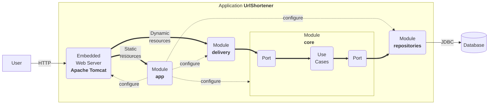

# Getting Started with the URL Shortener project

2024-08-31

## System requirements

This application leverages cutting-edge technologies to deliver a robust
and versatile user experience:

1.  **Programming Language**: The application is written in [Kotlin
    2.0.20](https://kotlinlang.org/), a versatile, open-source,
    statically-typed language. Kotlin is renowned for its adaptability
    and is commonly used for Android mobile app development. Beyond
    that, it finds application in server-side development, making it a
    versatile choice.

2.  **Build System**: The application utilizes [Gradle
    8.5](https://gradle.org/) as its build system. Gradle is renowned
    for its flexibility in automating the software building process.
    This build automation tool streamlines tasks such as compiling,
    linking, and packaging code, ensuring consistency and reliability
    throughout development.

3.  **Framework**: The application employs [Spring Boot
    3.3.3](https://docs.spring.io/spring-boot/) as a framework. This
    technology requires Java 17 and is fully compatible up to and
    including Java 21. Spring Boot simplifies the creation of
    production-grade [Spring-based applications](https://spring.io/). It
    adopts a highly opinionated approach to the Spring platform and
    third-party libraries, enabling developers to initiate projects with
    minimal hassle.

## Overall structure

The structure of this project is heavily influenced by [the clean
architecture](https://blog.cleancoder.com/uncle-bob/2012/08/13/the-clean-architecture.html):

- A `core` module where we define the domain entities and the
  functionalities (also known as use cases, business rules, etc.). They
  do not know that this application has a web interface or that data is
  stored in relational databases.
- A `repositories` module that knows how to store domain entities in a
  relational database.
- A `delivery` module that knows how to expose the functionalities on
  the web.
- An `app` module that contains the main application, the configuration
  (i.e., it links `core`, `delivery`, and `repositories`), and the
  static assets (i.e., HTML files, JavaScript files, etc.).



Usually, if you plan to add a new feature:

- You will add a new use case to the `core` module.
- If required, you will modify the persistence model in the
  `repositories` module.
- You will implement a web-oriented solution to expose it to clients in
  the `delivery` module.

Sometimes, your feature will not be as simple, and it may require:

- Connecting to a third party (e.g., an external server). In this case,
  you will add a new module named `gateway` responsible for such a task.
- An additional application. In this case, you can create a new
  application module (e.g., `app2`) with the appropriate configuration
  to run this second server.

Features that require connecting to a third party or having more than a
single app will be rewarded.

## Run

The application can be run as follows:

``` bash
./gradlew bootRun
```

Now you have a shortener service running at port 8080. You can test that
it works as follows:

``` bash
$ curl -v -d "url=http://www.unizar.es/" http://localhost:8080/api/link
*   Trying ::1:8080...
* Connected to localhost (::1) port 8080 (#0)
> POST /api/link HTTP/1.1
> Host: localhost:8080
> User-Agent: curl/7.71.1
> Accept: */*
> Content-Length: 25
> Content-Type: application/x-www-form-urlencoded
> 
* upload completely sent off: 25 out of 25 bytes
* Mark bundle as not supporting multiuse
< HTTP/1.1 201 
< Location: http://localhost:8080/tiny-6bb9db44
< Content-Type: application/json
< Transfer-Encoding: chunked
< Date: Tue, 28 Sep 2021 17:06:01 GMT
< 
* Connection #0 to host localhost left intact
{"url":"http://localhost:8080/tiny-6bb9db44","properties":{"safe":true}}%   
```

And now, we can navigate to the shortened URL.

``` bash
$ curl -v http://localhost:8080/6bb9db44
*   Trying ::1:8080...
* Connected to localhost (::1) port 8080 (#0)
> GET /tiny-6bb9db44 HTTP/1.1
> Host: localhost:8080
> User-Agent: curl/7.71.1
> Accept: */*
> 
* Mark bundle as not supporting multiuse
< HTTP/1.1 307 
< Location: http://www.unizar.es/
< Content-Length: 0
< Date: Tue, 28 Sep 2021 17:07:34 GMT
< 
* Connection #0 to host localhost left intact
```

## Build and Run

The uberjar can be built and then run with:

``` bash
./gradlew build
java -jar app/build/libs/app-0.2024.1-SNAPSHOT.jar
```

## Functionalities

The project offers a minimum set of functionalities:

- **Create a short URL**. See in `core` the use case
  `CreateShortUrlUseCase` and in `delivery` the REST controller
  `UrlShortenerController`.

- **Redirect to a URL**. See in `core` the use case `RedirectUseCase`
  and in `delivery` the REST controller `UrlShortenerController`.

- **Log redirects**. See in `core` the use case `LogClickUseCase` and in
  `delivery` the REST controller `UrlShortenerController`.

The objects in the domain are:

- `ShortUrl`: the minimum information about a short URL
- `Redirection`: the remote URI and the redirection mode
- `ShortUrlProperties`: a handy way to extend data about a short URL
- `Click`: the minimum data captured when a redirection is logged
- `ClickProperties`: a handy way to extend data about a click

## Delivery

The above functionality is available through a simple API:

- `POST /api/link` which creates a short URL from data send by a form.
- `GET /{id}` where `{id}` identifies the short URL, deals with
  redirects, and logs use (i.e. clicks).

In addition, `GET /` returns the landing page of the system.

## Repositories

All the data is stored in a relational database. There are only two
tables.

- **shorturl** that represents short URLs and encodes in each row
  `ShortUrl` related data,
- **click** that represents clicks and encodes in each row `Click`
  related data.

## Reference Documentation

For further reference, please consider the following sections:

- [Official Gradle documentation](https://docs.gradle.org)
- [Spring Boot Gradle Plugin Reference
  Guide](https://docs.spring.io/spring-boot/docs/current/gradle-plugin/reference/htmlsingle/)
- [Spring
  Web](https://docs.spring.io/spring-boot/reference/web/index.html)
- [Spring SQL
  Databases](https://docs.spring.io/spring-boot/reference/data/sql.html)

## Guides

The following guides illustrate how to use some features concretely:

- [Building a RESTful Web
  Service](https://spring.io/guides/gs/rest-service/)
- [Serving Web Content with Spring
  MVC](https://spring.io/guides/gs/serving-web-content/)
- [Building REST services with
  Spring](https://spring.io/guides/tutorials/rest/)
- [Accessing Data with
  JPA](https://spring.io/guides/gs/accessing-data-jpa/)

# ✅ Proof of Concept
In this section, the results of the Proof of Concept completed on October 25th are presented, 
detailing both the developed functionality and the tests that validate its viability within the code. 
Additionally, it includes a brief description of the team management and the software tools used for this milestone.

## CSV Upload
The UseCase and controller for managing CSV files uploading support in the application have been developed.
The goal is to provide users with the ability to upload a CSV file from the client interface and 
receive it through the developed controller. Once received, the CreateShortUrlUseCase service should 
be used to generate a new CSV file with all the shortened URLs and return it as a downloadable 
file to the users. In this first version, no CSV file is generated yet; instead, the result of 
the incoming file is returned in the response from the controller call, 
containing the info about hash, redirection url and mode generated from these URLs in CSV format.

### Tests implemented
First, a manual test was conducted with a CSV file containing 10 URLs. 
The application correctly returned the generated hashes for each one in the POST call response.
The same process was repeated with a file containing 100 URLs and then with 1000 URLs. 
The application successfully performed the transformation in both cases with minimal latency.

In addition, CSVUploadUseCaseTest file has been created.
It is verified that for a valid CSV file, it is transformed correctly.
Similarly, it is also ensured that for an empty file, the application returns an empty value, completing the flow consistently.

## Geolocation Service
A UseCase plus controller to deal with the geolocation requests in-app has been created. The goal is enabling users to gather geolocational data for a dedicated IP-address via the client interface. The GeolocationController receives the request with an IP address and forwards it to a special method that is responsible for processing this data, which delegates itself what should be done to service (GeolocationUseCase). This service is about how to access an external API such as a geolocation. A basic version of the application that retrieves geolocations details in form of a map returning key-value pairs after querying for location related to provided IP address was created successfully, as shown below. It also handles invalid IP addresses using error checking i.e. raising appropriate exceptions where necessary.

## QR Code Generation
The use case has been developed to allow the generation of a QR code based on a URL provided in the client’s HTML form.
In this first version, the URL submission service is not yet utilized, but it is planned for future releases. 
For this use case to function, the QRGeneratorController has been developed, which provides a POST method to the client 
through the API, and the QRGeneratorUseCase service, which contains the necessary logic for generating the 
corresponding code.

### Tests implemented
The developed tests on QRGeneratorUseCaseTest ensure that the QR code generation works correctly for a valid URL and throws proper
exception when receives an invalid URL, using the validator service already developed for Shortener Use Case.

## Branded Links
Created UseCase, Controller to manage Branded links in the app. This is designed to allow clients create and brand their own unique links using the client panel. Here we have a BrandedLinkController which will accept requests for the original URL and an alias. To complete the carousel, a service named BrandedLinkUseCase is used to manage these branded links; we can create, read set of them, and also delete or redirect by this remapping point. The system also do not have any other premium features like QR code generation, analytics but still achieved to fulfill it is basic functionalities: managing create and delete brand links with a consideration that no user can use the same alias for different links.

## Software tools used for PoC
For the QR code generator, the [Zxing](https://github.com/zxing) library has been used.
ZXing is an open-source library for generating and decoding barcodes and QR codes. 
It supports various barcode formats, including QR Code, UPC, EAN, and more. 
ZXing is widely used in applications due to its versatility and efficiency.

To support CSV files, [OpenCSV](https://opencsv.sourceforge.net/) has been used. 
This is a popular library in Java for reading and writing CSV files. It provides 
a simple and efficient way to handle CSV data, allowing for easy parsing and generation of CSV format.

## How to run the PoC
- Tests can be executed with the same command: `./gradlew test`
- To use the new features, just run `./gradlew bootRun` and open [localhost:8080](http://localhost:8080/) in any browser

## Challenges during PoC implementation
Initially, the idea was proposed for the QRGeneration controller to offer a GET method,
but this caused issues with passing parameters from app.js, so a POST method was chosen instead.

The management of CSV files has posed a challenge for both uploading and processing them,
requiring extensive consultation of documentation and tutorials on using the opencsv library
and how to implement it in the application.

The errors encountered while compiling the Geolocation and BrandedLink features, of the type IllegalStateException, have prevented them from being executed to verify their correct functioning. As a result, their respective tests could not be carried out.

# 🤖 Working Prototype

In this section, a basic functional, synchronous or asynchronous implementation of each feature has been developed on November 22th.
Each feature implementation includes tests that validate functionality and address feedback from the PoC.

## CSV Upload
During the development of this milestone, it was discovered that the CSV Upload service did not correctly interpret 
all the URLs on the same line in the input file. To address this issue, the code was modified, and a test file 
`/delivery/src/main/resources/testingCSVUpload.csv` containing 100 URLs was created to verify the correct functionality
of the new code. Additionally, the client was updated to allow downloading the resulting CSV file. Initially, 
this caused several issues due to the way the controller's response was being sent. The client did not interpret 
the response as a blob. Debugging the code required several iterations to resolve the problem. Currently, the use 
case works perfectly.

### Generating shorten urls CSV file
To generate the CSV file, simply run the application and open the client on [localhost:8080](http://localhost:8080/) in your favourite browser.
From there, click on input `Choose file` and select a valid CSV file for this use case.
You can use the file `/delivery/src/main/resources/testingCSVUpload.csv` to test the use case.

### Tests developed for this feature

The first test proves that the transform method correctly processes a non-empty CSV, showing its primary functionality works as expected. By mocking CreateShortUrlUseCase, it isolates the CSVUploadUseCase behavior.
The second test ensures the use case handles edge cases, such as an empty file, without throwing errors or producing unexpected output.
Together, these tests comprehensively validate the CSV transformation use case for both normal and edge-case scenarios.

## QR Code Generation
The QR generation process has been updated so that the content of the QR codes corresponds to the shortened URL of 
the one passed as a parameter in the client's request, using the existing service for shortening URLs. 
If a shortened URL already exists for the requested parameter, it is returned directly instead of creating a new one. 
Additionally, a QR code cache has been implemented using the [Caffeine library](https://github.com/ben-manes/caffeine) 
by adding a private attribute to the QR generation service. The Caffeine library is a high-performance, 
caching library designed for efficiency and low latency. It provides a near-optimal cache replacement policy inspired 
by the Windows Clock-Pro algorithm. Caffeine is lightweight and supports features such as automatic loading, 
asynchronous computations, time-based or size-based eviction policies, and customizable expiration settings. 
This way, when the generate method is called, the service checks the cache, which has a maximum
size of 100 entries and resets after 1 hour. If it finds an entry with the requested hash, it returns it directly; 
otherwise, it generates a new QR code and adds it to the cache. This approach optimizes the generation of QR codes 
frequently requested by users. The maximum cache size can be adjusted based on the application's user traffic.

The main challenge encountered was how to correctly use the shortened URL as the QR content since the encode 
function of the Zxing library only accepts strings as its content parameter. As a result, the URL had to be 
explicitly constructed using the provided hash. This approach sacrifices some code maintainability to resolve the issue.

### Generating QRCodes
To generate QR codes, simply run the application and open the client on [localhost:8080](http://localhost:8080/) in your favourite browser. 
From there, just fill in the input field with a valid URL and click the `Generate QR` button. The QR code will be generated right below.

## Geolocation
The GeolocationController is a Spring REST Controller designed to handle HTTP requests for geolocation data. It provides a single endpoint that allows clients to retrieve geolocation information based on a provided IP address. This controller serves as the entry point for the geolocation functionality, where requests are processed and responses are sent back to the client.
The controller relies on the GeolocationUseCase class, which is injected as a dependency. This use case encapsulates the business logic for fetching geolocation data. The controller defines a GET endpoint at the path /api/geolocation. This endpoint accepts a query parameter, ip, representing the IP address for which geolocation data is requested. When the endpoint is invoked, the controller calls the getGeolocation method from the GeolocationUseCase, passing the provided IP address. The result, a Geolocation object, is returned as the response in JSON format.
The GeolocationUseCase class implements the logic to fetch geolocation information for a given IP address by leveraging the RestTemplate class to make HTTP requests to the external IPStack API. The API URL includes an access key for authentication, which is stored in the class as a private field. The method getGeolocation constructs the API URL by replacing the placeholder with the actual IP address. It then performs a GET request to the API and maps the response to a GeolocationResponse object. If no response is received or an error occurs, an exception is thrown to indicate the failure.
In summary, the two files work together to provide a clean and modular implementation for retrieving geolocation data. The controller handles user interactions, while the use case encapsulates the core logic for interacting with the external API.
The test has been implemented, but it has not been verified because the functionality is not working correctly.

### Test developed for this feature

The purpose of this test is to validate that the QRGeneratorUseCaseImpl successfully generates a QR code for a valid URL and that the QR code has the expected dimensions.

## Other aspects of project

The GitHub repository remains public because, having been created as a fork of the original urlshortener, it is not possible to change its visibility.